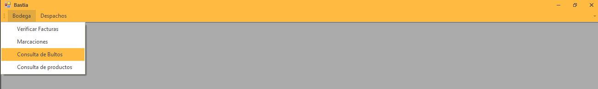
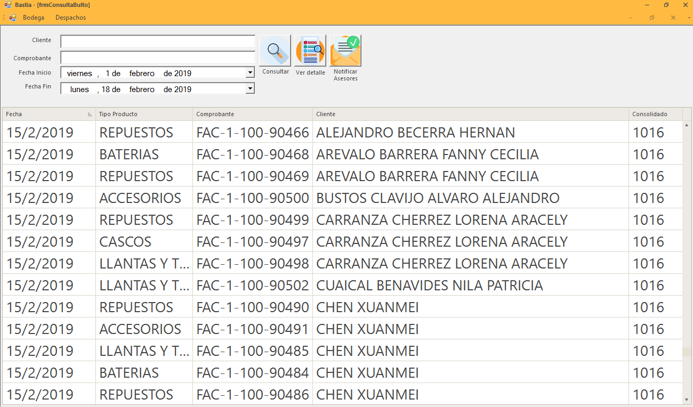

Bultos
======

Nos dirigimos al menú **Bodega** en la parte izquierda y seleccionamos la opción **Consulta de Bultos**.

Busqueda de Bultos
------------------

Pasos  realizar la busqueda de bultos

1. Seleccionar la fecha de inicio de busqueda.
2. Seleccionar la fecha de finalización de busqueda.
3. Dar clic en consultar bultos y filtra los datos.

Ver Detalle de Bultos
---------------------

Se visualiza todos los productos que fueron verificados y agrupados dentro del bulto con sus características.

1. Número de Bulto.
2. Descripción del Contenido del Bulto.
3. Peso del Bulto 

..

Busqueda por Cliente
~~~~~~~~~~~~~~~~~~~~		

En el cuadro de texto que indica **Cliente** digítamos el nombre del cliente que deseamos buscar.

.. image:: ../bastia/images/frmbulto3.png  
    :width: 600px
..

Busqueda por Comprobante
~~~~~~~~~~~~~~~~~~~~~~~~			

En el cuadro de texto que indica **Comprobante** digítamos el número de factura que deseamos buscar
git 

.. image:: ../bastia/images/frmbulto4.png  
    :width: 600px
..

Guías
------

Guías de Motoralmor
~~~~~~~~~~~~~~~~~~~~

Dando clic imprime todas las etiquetas de los bultos.

Guías de Laar
~~~~~~~~~~~~~

Genera la guía de remisión para la empresa de transporte LAAR COURIER y nos muestra un archivo pdf.

Eliminar Guías
~~~~~~~~~~~~~

Envía una notificación via e-mail al personal de bodega que la guía de LAAR COURIER debe ser eliminada para la factura o grupo de facturas.

Asesores
--------

Envía una notificación via e-mail a:

- Vendedor.
- Departamento de Cartera.
- Departamento Comercial.
- Departamento de Bodega.

Con con el siguiente detalle:

+-------------------------------------------------------+                                                                                                     
|   **Cliente:** ``Nombres y Apellidos del Cliente``    |
+-------------------------------------------------------+  
|   **Guía**: ``Número de Guía``                        | 
+-------------------------------------------------------+                                                                                        
|   **Ciudad:** ``Ubicación del Cliente``               | 
+-------------------------------------------------------+                                                                                                        
|   **TRANSPORTE:**  ``Transportista del Paquete``      |                
+-------------------------------------------------------+ 
|   **Factura:** ``Número de Factura``                  |               
+-------------------------------------------------------+                                                 
|   **Bultos:** ``Contenido del Paquete``               |
+-------------------------------------------------------+ 

	

