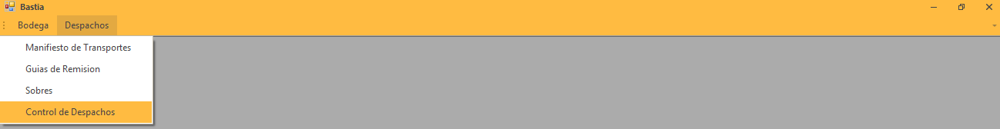
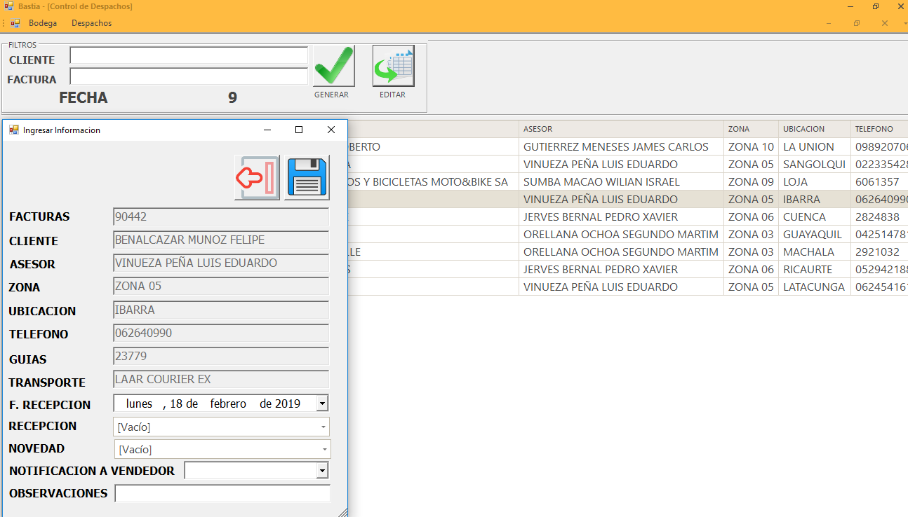

   
Despachos
============

Nos dirigimos al menú **Despachos** en la parte derecha y seleccionamos la opción **Control Despachos**.

..

El objetivo de llevar un control de despachos son los siguientes:

1. Se cumple el plazo de tiempo de entrega.
2. El estado de los paquetes al ser entregados.
3. Un tracking de los paquetes.

Campos de Control Despachos
---------------------------
	
+----------------------------------------------------------------------------------------+                                                                                                     
|   **FACTURAS:** ``NUMERO DE FACTURAS``                                                 |
+----------------------------------------------------------------------------------------+  
|   **CLIENTE**: ``CLIENTE DE MOTORALMOR``                                               | 
+----------------------------------------------------------------------------------------+                                                                                        
|   **ASESOR:** ``VENDEDOR ASIGNADO``                                                    | 
+----------------------------------------------------------------------------------------+                                                                                                        
|   **ZONA:**  ``ZONA DEL CLIENTE``                                                      |                
+----------------------------------------------------------------------------------------+ 
|   **UBICACION:** ``UBICACION DEL CLIENTE``                                             |               
+----------------------------------------------------------------------------------------+                                                 
|   **TELÉFONO:** ``NÚMERO TELÉFONICO DEL CLIENTE``                                      |
+----------------------------------------------------------------------------------------+ 

Editar Control
--------------

Para registra alguna novedad damos clic en editar para registrar alguna novedad con la entrega.

1. En recepción seleccionamos en el tiempo que fue entregado el paquete.
2. En novedad escribimos si se registro alguna anomalía.

..

