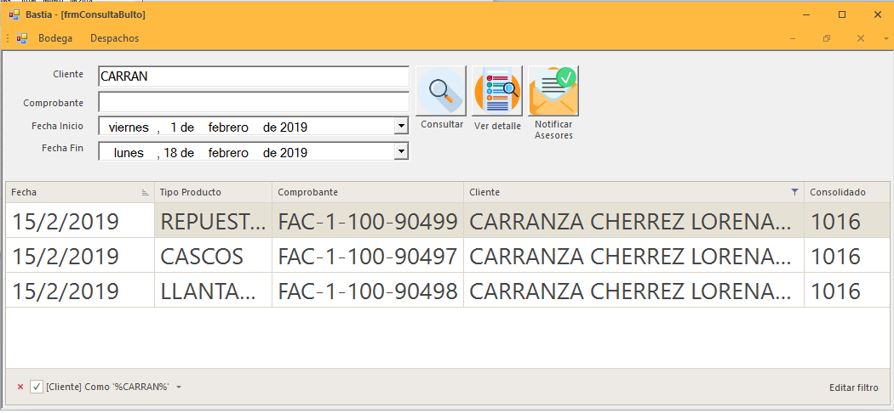

.. note::
   
Identificar cada producto con su código correspondiente y la descripción en la factura
	
Verificación
============

Para acceder al menú de Facturación nos dirigimos a la parte superior en el menú Bodega y escogemos la opción
Verificar Facturas

..

Grupo de Trabajo
----------------
Para verificar las facturas ,seleccionamos  el icono usuario se visualiza el siguiente formulario, las 
personas que conforman el grupo de trabajo

..

Verificación de Facturas
------------------------

Seleccionar Facturas
~~~~~~~~~~~~~~~~~~~~		

Para verificar las facturas se presentan dos opciones en la parte superior izquierda se puede buscar por cliente o por factura emitida.

Busqueda por Cliente
^^^^^^^^^^^^^^^^^^^^

En el cuadro de texto digítamos por el nombre de cliente que deseamos buscar.

 .. image:: ../bastia/images/frmfacturas4.png  
    :width: 600px

 ..
**En la parte inferior izquierda nos indica el filtro que estamos aplicando para la busqueda.**

Busqueda por Numeración
^^^^^^^^^^^^^^^^^^^^^^^

En el cuadro de texto digítamos por el número de facturas que deseamos buscar.

..

**En la parte inferior izquierda nos indica el filtro que estamos aplicando para la busqueda.**

Verificación de Productos
~~~~~~~~~~~~~~~~~~~~~~~~~~					

Seleccionadas las facturas procedemos con la verificación los productos.

Verificación con Lector
^^^^^^^^^^^^^^^^^^^^^^^^

Se desliza el producto por el lector y nos marca en la caja de texto el código leído.

..

**En la imagen indica el código verificado y la cantidad correspondiente.**

Verificación con Manual
^^^^^^^^^^^^^^^^^^^^^^^^

Seleccionamos el producto que deseamos verificar y digítamos la cantidad a verificar

..

Bultos
------

Nos dirigimos al menú **Bodega** en la parte izquierda y seleccionamos la opción **Consulta de Bultos**.

.. image:: ../bastia/images/frmbulto.png  
    :width: 600px

Busqueda de Bultos
^^^^^^^^^^^^^^^^^^

Pasos  realizar la busqueda de bultos

1. Seleccionar la fecha de inicio de busqueda.
2. Seleccionar la fecha de finalización de busqueda.
3. Dar clic en consultar bultos y filtra los datos.

Ver Detalle de Bultos
^^^^^^^^^^^^^^^^^^^^^

Se visualiza todos los productos que fueron verificados y agrupados dentro del bulto con sus características.

1. Número de Bulto.
2. Descripción del Contenido del Bulto.
3. Peso del Bulto 

.. image:: ../bastia/images/frmbulto2.png  
    :width: 600px
..

Busqueda por Cliente
~~~~~~~~~~~~~~~~~~~~		

En el cuadro de texto que indica **Cliente** digítamos el nombre del cliente que deseamos buscar.

..

Busqueda por Comprobante
~~~~~~~~~~~~~~~~~~~~~~~~			

En el cuadro de texto que indica **Comprobante** digítamos el número de factura que deseamos buscar.

..

Guías
-----

Guías de Motoralmor
^^^^^^^^^^^^^^^^^^^

Son las creadas para identificacion interna de las cajas o bultos,se indica los campos impresos en la etiqueta.

+---------------------------------------------------------------------------------------------------------+
| **CLIENTE**: ``Persona y/o empresa destinataria``               **TOTAL #/** ``Numero de Etiqueta``     | 
+---------------------------------------------------------------------------------------------------------+  
|   **CIUDAD:** ``Ciudad destino``                                                                        |  
+---------------------------------------------------------------------------------------------------------+ 
|   **DESPACHO:** ``Fecha de Empaque``                                                                    |  
+---------------------------------------------------------------------------------------------------------+ 
|   **TRANSPORTE:** ``Transportista``                                                                     |
+---------------------------------------------------------------------------------------------------------+
|   **OBSERVACION:** ``Nota``                                                                             | 
+---------------------------------------------------------------------------------------------------------+ 
|   **PESO:** ``Peso del Bulto o Caja``                                                                   |
+---------------------------------------------------------------------------------------------------------+
|   ``Iniciales de las personas que hicieron  verificacion``                                              | 
+---------------------------------------------------------------------------------------------------------+                            
|   ``Id de Bulto``                                       **CAJA #/** ``Numero de Caja``                  | 
+---------------------------------------------------------------------------------------------------------+      

Guías de Laar
^^^^^^^^^^^^

Genera la guía de remisión para la empresa de transporte LAAR COURIER y nos muestra un archivo pdf.

Eliminar Guías
^^^^^^^^^^^^^^

Envía una notificación via e-mail al personal de bodega que la guía de LAAR COURIER debe ser eliminada para la factura o grupo de facturas.

Asesores
--------

Envía una notificación via e-mail a:

- Vendedor.
- Departamento de Cartera.
- Departamento Comercial.
- Departamento de Bodega.

Con con el siguiente detalle:

+-------------------------------------------------------+                                                                                                     
|   **Cliente:** ``Nombres y Apellidos del Cliente``    |
+-------------------------------------------------------+  
|   **Guía**: ``Número de Guía``                        | 
+-------------------------------------------------------+                                                                                        
|   **Ciudad:** ``Ubicación del Cliente``               | 
+-------------------------------------------------------+                                                                                                        
|   **TRANSPORTE:**  ``Transportista del Paquete``      |                
+-------------------------------------------------------+ 
|   **Factura:** ``Número de Factura``                  |               
+-------------------------------------------------------+                                                 
|   **Bultos:** ``Contenido del Paquete``               |
+-------------------------------------------------------+ 

