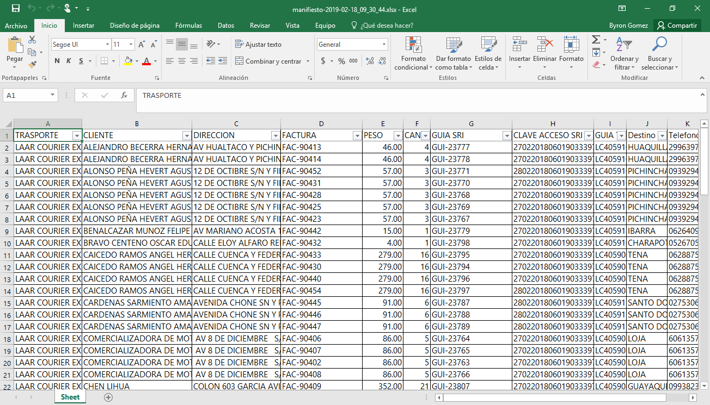

Manifiesto
==========

Nos dirigimos al menú **Despachos** en la parte derecha y seleccionamos la opción **Manifiesto de Transportes**.

..

Generar Manifiesto
------------------

El manifiesto nos genera un listado de las guías generadas para el SRI,los pasos para generar el manifiesto son:

1.Seleccionamos la fecha en el calendario de la cual deseamos generar el manifiesto.

2.Damos clic en actualizar y nos generar un listado de las guías correspondiente a esa fecha.

      **En la imagen nos indica  el listado de guías y la fecha correpondiente.**
..

Busqueda por Cliente
^^^^^^^^^^^^^^^^^^^^^
Generado el manifiesto podemos buscar por cliente,digitando que deseamos buscar en el  cuadro de texto.

    **En la imagen nos indica los filtro de busqueda usado**
..

Busqueda por Transporte
^^^^^^^^^^^^^^^^^^^^^^^
Generado el manifiesto podemos buscar por transporte,digitando que deseamos buscar en el  cuadro de texto.

    **En la imagen nos indica los filtro de busqueda usado**
..

Campos del Manifiesto
---------------------

+----------------------------------------------------------------------------------------+                                                                                                     
|   **TRANSPORTE:** ``TRANSPORTISTA``                                                    |
+----------------------------------------------------------------------------------------+  
|   **CLIENTE**: ``PERSONA Y/O EMPRESA DESTINATARIA``                                    | 
+----------------------------------------------------------------------------------------+                                                                                        
|   **DIRECCION:** ``DIRECCION DE LA PERSONA Y/O EMPRESA DESTINATARIA``                  | 
+----------------------------------------------------------------------------------------+                                                                                                        
|   **FACTURA:**  ``NUMERO DE FACTURA``                                                  |  
+----------------------------------------------------------------------------------------+ 
|   **PESO:** ``PESO  TOTAL DE LOS BULTOS/CAJAS``                                        |  
+----------------------------------------------------------------------------------------+                                                 
|   **CANTIDAD:** ``CANTIDAD DE BULTOS/CAJAS EN LA FACTURA``                             |
+----------------------------------------------------------------------------------------+ 
|   **GUIA SRI:** ``NUMERO DE GUIA DEL SRI``                                             |
+----------------------------------------------------------------------------------------+ 
|   **CLAVE DE ACCESO:** ``CLAVE DE ACCESO DE LA GUIA DEL SRI``                          |
+----------------------------------------------------------------------------------------+ 
|   **DESTINO:** ``CIUDAD DESTINO DEL PAQUETE``                                          | 
+----------------------------------------------------------------------------------------+ 
|   **TELEFONO:** ``TELEFONO DE LA PERSONA Y/O EMPRESA DESTINATARIA``                    |                                                       
+----------------------------------------------------------------------------------------+

Exportar Manifiesto
-------------------

Al dar clic  en exportar el manifiesto nos muestra una barra de progreso que los datos están siendo exportados a Excel.

..

Podemos visualizar en un libro de Excel,el manifiesto generado.

..
	

