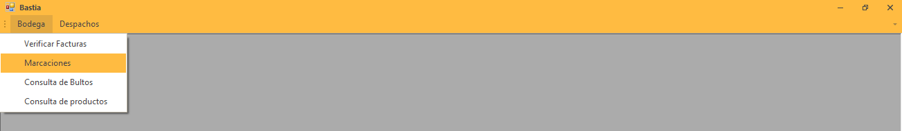
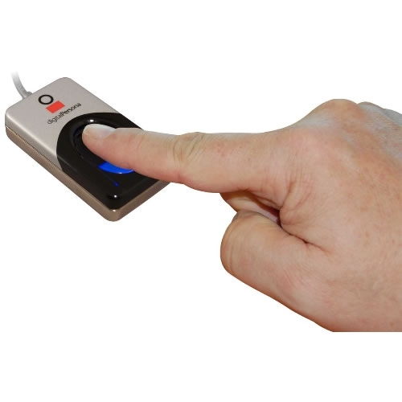

   
   .. tip:: 
Para registrar la actividad a realizar el lector debe registrar su huella.
	
Marcación
==========

Para acceder a la opción de marcación nos ubicamos en la parte izquierda y escogemos en el menú Bodega escogemos
la opción Marcación...

..

Registrar Actividad
-------------------

EL personal de bodega debe colocar la huella antes registrada antes de empezar la actividad a realizar,como se indica en la imagen.

    
..
  
Actividades
------------

A continuación detallamos el listado de actividades y una breve descripción.

Consolidado
~~~~~~~~~~~~

Recolección de productos para la verificación de facturas.

Despachos
~~~~~~~~~

Despachar mercadería.

Conteo Ciclíco
~~~~~~~~~~~~~~

Conteo de algún producto por un período de tiempo.

Descarga Contenedor
~~~~~~~~~~~~~~~~~~~

Descargo de importación.

Contingencia
~~~~~~~~~~~~

Cumplir Actividades

Empaquetado 
~~~~~~~~~~~

Empaquetado de productos.

Control de Calidad
~~~~~~~~~~~~~~~~~~

Verificación de calidad de productos seleccionados.

Etiquetado
~~~~~~~~~~

Impresión de Etiquetas y colocación al respectivo producto.

Cuadre de Contenedor
~~~~~~~~~~~~~~~~~~~~

Verificación de productos importados.

Almuerzo
~~~~~~~~~

Salida almuerzo.
	
