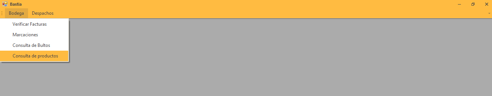
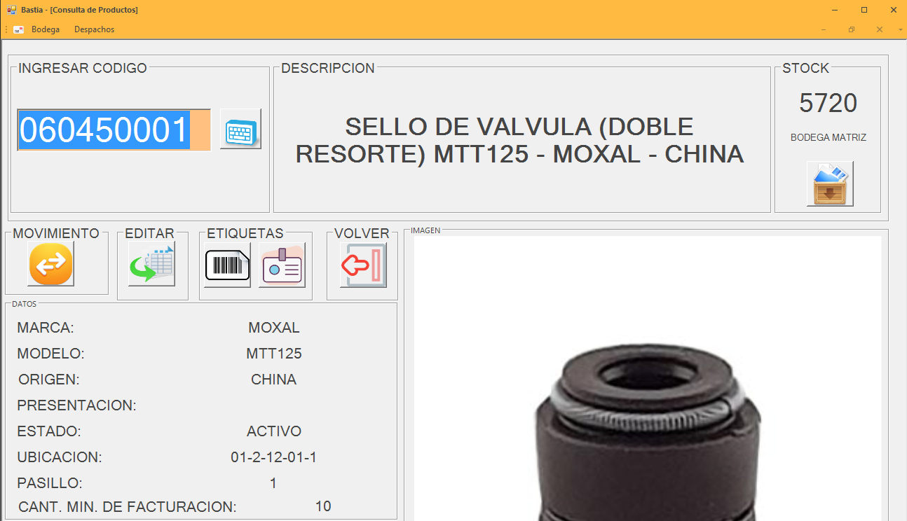
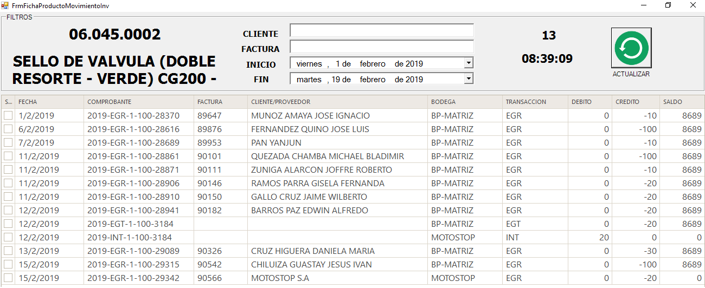
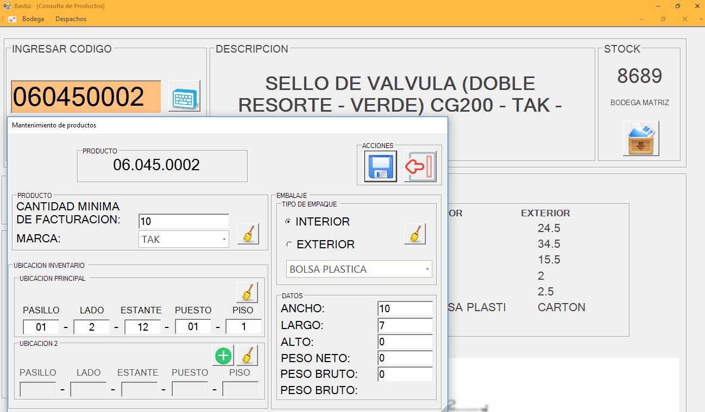
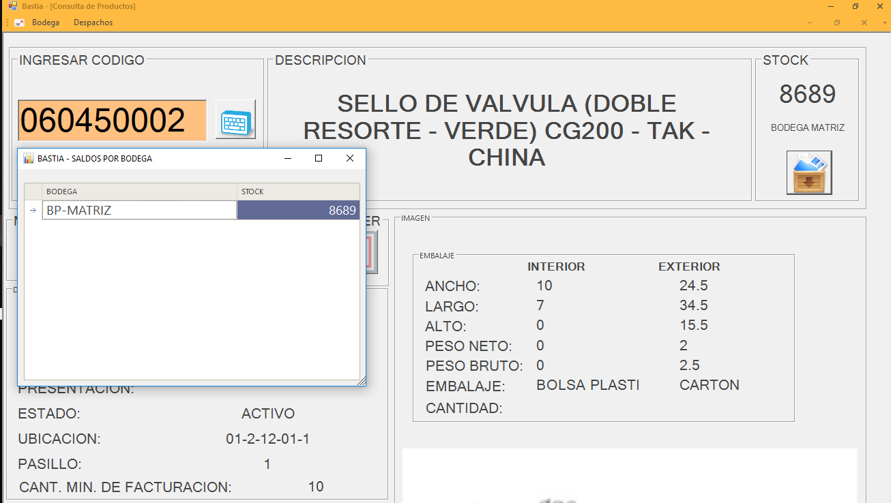

Productos
=========

Nos dirigimos al menú **Despachos** en la parte derecha y seleccionamos la opción **Consulta de Productos**.

..

Busqueda 
--------

Para realizar la busqueda de productos se puede realizar de  dos formas.

1. Digitando el código del producto sin puntos en el cuadro de texto.
2. Digitando el código del producto en el cuadro de texto.

..

En el formulario nos indica toda la información referente a un producto:

**Datos del Producto**

+--------------------------------------------------------------------------------------------+                                                                                                     
|   **DESCRIPCION:** ``Nombre del Producto``                                                 |
+--------------------------------------------------------------------------------------------+  
|   **STOCK**: ``Cantidad Existente``                                                        | 
+--------------------------------------------------------------------------------------------+                                                                                        
|   **MODELO:** ``Modelo del Producto``                                                      | 
+--------------------------------------------------------------------------------------------+                                                                                                        
|   **ORIGEN:**  ``País de Origen``                                                          |  
+--------------------------------------------------------------------------------------------+ 
|   **PRESENTACIÓN:** ``Presentación en la que viene el producto``                           |  
+--------------------------------------------------------------------------------------------+                                                 
|   **ESTADO:** ``Si el producto esta activo o inactivo``                                    |
+--------------------------------------------------------------------------------------------+ 
|   **UBICACION:** ``Sección del pasillo``                                                   |
+--------------------------------------------------------------------------------------------+ 
|   **PASILLO:** ``Pasillo donde esta ubicado el producto``                                  |
+--------------------------------------------------------------------------------------------+ 
|   **CANTIDAD MÍNIMA DE FACTURACIÓN:** ``Cantidad mínima para que el producto sea vendido`` |                        
+--------------------------------------------------------------------------------------------+ 

**Embalaje del Producto**

La tabla nos indicara tanto las características del embalaje interno y externo del producto.

+----------------------------------------------------------------+                                                                                                
|   **ANCHO:** ``Ancho del embalaje en centímetros``             |                                            
+----------------------------------------------------------------+                                                                                              
|   **LARGO:** ``Longitud del embalaje en centímetros``          |                                            
+-------------------------------------------+--------------------+  
|   **PESO NETO**: ``Peso neto en Kg.``                          | 
+----------------------------------------------------------------+                                                                                        
|   **PESO BRUTO:** ``Peso bruto en Kg.``                        | 
+----------------------------------------------------------------+                                                                                                        
|   **EMBALAJE:**  ``Presentación en la que viene el producto``  |                                                 
+----------------------------------------------------------------+ 
|   **CANTIDAD:** ``Cantidad del Producto``                      |  
+----------------------------------------------------------------+                                                     

Movimiento de Producto
----------------------

Aquí podremos visualizar las cantidades facturadas del producto en un período de fecha.

1. Seleccionamos la fecha de inicio y fecha de finalización.
2. Damos click en actualizar y nos muestra el movimiento del producto.

..

La información que se indica con el movimiento es:

- Fecha del movimiento.
- Comprobante del movimiento.
- Número de factura.
- Nombre del cliente.
- Bodega donde se produjo el movimiento.
- Tipo de transacción
- Debito del producto
- Credito del producto
- Saldo existente del producto.

Edición de Producto
--------------------

Podemos editar las características del producto seleccionado 

..

Los campos que se pueden editar son los siguientes:

**Producto**

- Cantidad mínima para la facturación.
- Marca del Producto

**Ubicación**

- Ubicación del Producto que se indica de la siguiente manera **(PASILLO-LADO-ESTANTE-PUESTO-PISO)**
- Ubicación secundaria.

**Embalaje**

- Interno: En el que viene almacenado el producto
- Externo: En el contiene a los productos puede ser funda,caja.

Stock  de Producto
--------------------

Nos indica el saldo del producto y en la bodega donde esta ubicada.

..
