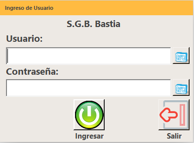

Sistema
=======

El software Bastia fue creado para la gestión de Bodega,engloba todos los procesos que se realizan en este departamento
de la Empresa.

Estructura de Bastia
--------------------

La estructura del software es de la siguiente manera::

  Formulario Principal
         │ 
         ├── Bodega
         │     ├── Verificar Facturas
         │     ├── Marcaciones 
         │     ├── Consulta de Productos
         │     ├── Consulta de Bultos
         │      
         ├── Despachos
               ├── Manifiesto de Transportes
               ├── Guías de Remisión
               ├── Sobres
               ├── Control de Despacho
..

Acceder a Bastia
----------------

- Con las credenciales que nos fueron asignadas para acceder al sistema.

El  *formulario de login* se ve así:

Credenciales
~~~~~~~~~~~~

- Usuario: El usuario que nos fue asigando para acceder al sistema por ejemplo: **GPML**

- Password: La clave asiganada previamente.

.. note::

  El usuario y la clave son de uso personal de cada persona.

  

	

   
	

