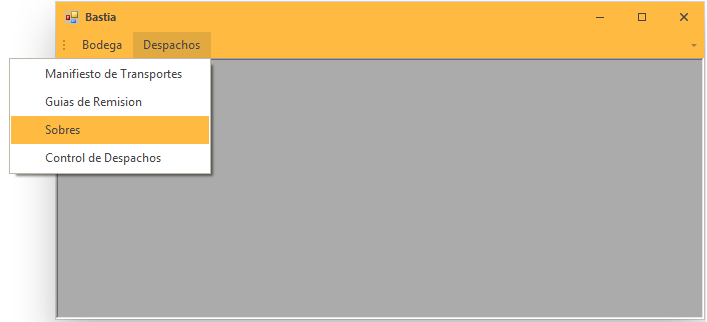
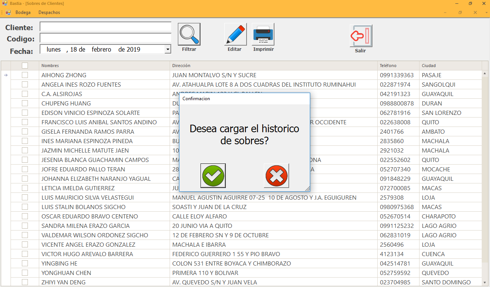
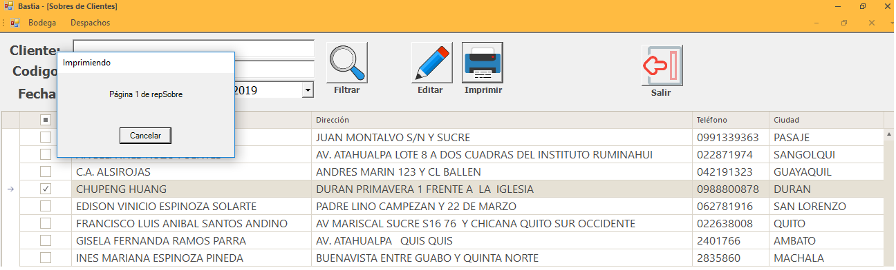

Sobres
=======

Nos dirigimos al menú **Despachos** en la parte derecha y seleccionamos la opción **Sobres**.

 
..

Los sobres corresponden a las facturas emitidas para el consolidado según la fecha escogida.

Listado
-------
Nos indica de todas las facturas  emitidas para el consolidado.

1. Escogemos en el calendario de la fecha que deseamos emitir el listado.
2. Damos clic en filtrar el mensaje nos indica si deseamos cargar el historico. 
3. Damos clic en el check de color verde y genera el listado.

..

Edición 
-------

.. note::

Para cambios de dirección o número teléfonico se debe indicar al personal de cartera.

Campos del Sobre
-----------------

+----------------------------------------------------------+ 
|   **CLIENTE**: ``PERSONA Y/O EMPRESA DESTINATARIA``      |                                                                                                     
+----------------------------------------------------------+
|   **CIUDAD:** ``CIUDAD DESTINO DEL PAQUETE``             |  
+----------------------------------------------------------+ 

Impresión 
---------

Seleccionamos el sobre que deseamos ,nos enviara a la impresora predeterminada para la impresión.

 
..

